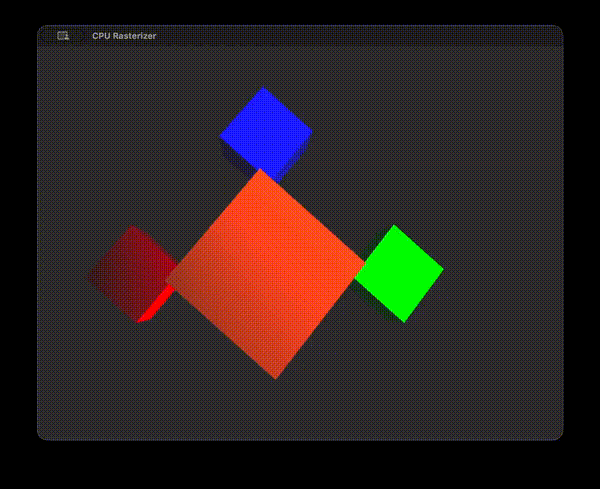

# CPU Rasterizer

A software rasterizer built from scratch without GPU APIs—just pure CPU rendering.



## About

A learning project exploring the fundamentals of 3D graphics rendering. This rasterizer implements core concepts from scratch, using only Cocoa for windowing on macOS.

## Features

- **Pure software rendering** - No OpenGL, Metal, or Vulkan. Every pixel is computed on the CPU
- **Barycentric rasterization** - Uses edge functions and barycentric coordinates for efficient triangle filling

## Building

**Requirements**: macOS, Xcode command-line tools

```bash
make
./bin/Rasterizer
```

## Controls

| Key   | Action                |
| ----- | --------------------- |
| W/S   | Move forward/backward |
| A/D   | Move left/right       |
| Space | Move up               |

## License

MIT
